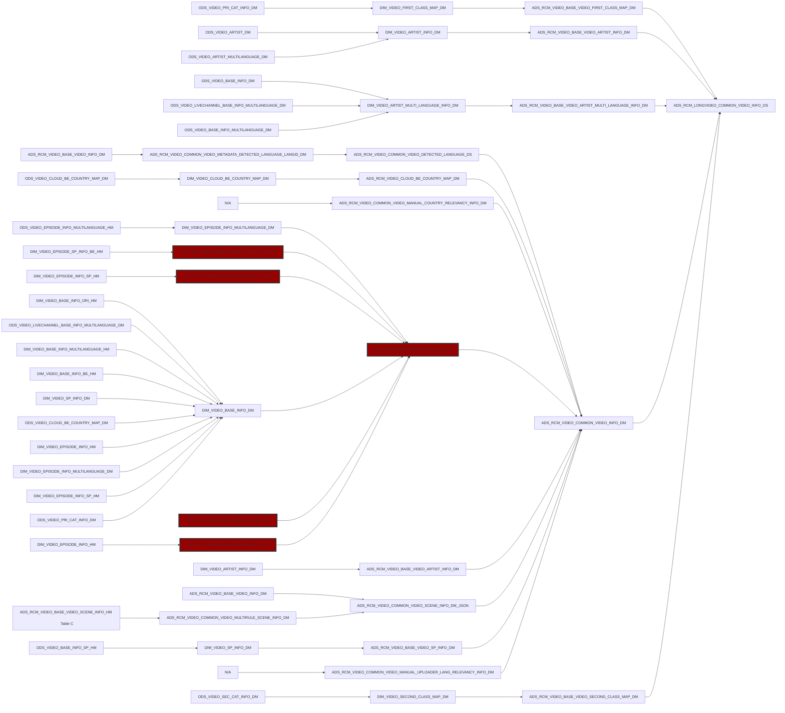
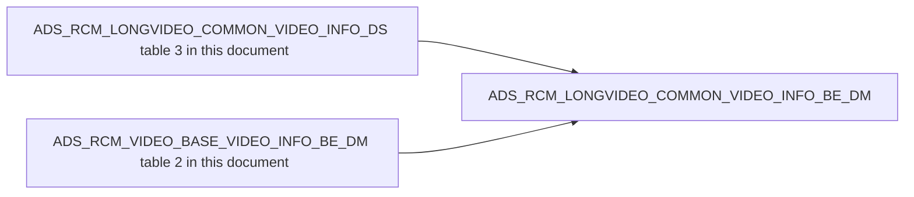
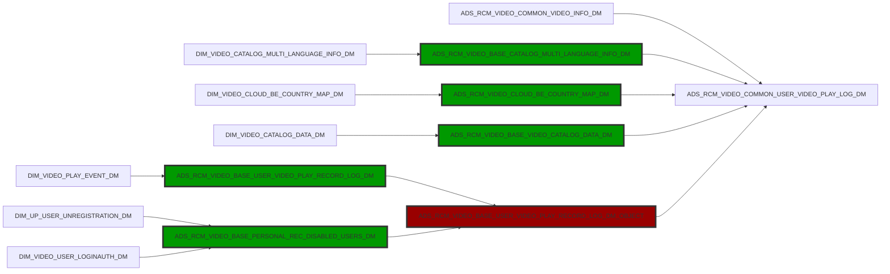
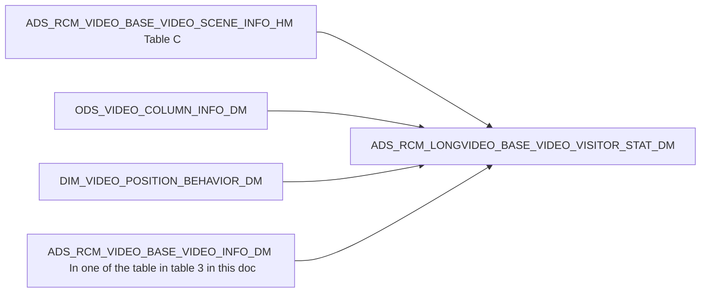

# RecommenderSystem

### Baseline model

将用户评分定义为全局平均分 + 用户bias + 物品 bias

$$
rating = u + b_{u} + b_{i}
$$

### Latent Facotr Model（LFM） 隐语义模型 

用 FunkSVD将item-user 矩阵分解为两个矩阵P and Q的乘积

# 1 BIADS.ADS_RCM_LONGVIDEO_COMMON_USER_PLAY_RECORD_LOG_DM

```mermaid
graph LR;

    %% D fifth layer 
    D1_2_1_1[ODS_DELETE_RCMACTIVITYLOG_DM]-->D1_2_1;


    %% D fourth layer
    D1_2_1[ADS_RCM_VIDEO_BASE_USER_DELETE_RCMACTIVITY_LOG_DM]-->D1_2;
    D1_2_2[ADS_RCM_VIDEO_COMMON_USER_VIDEO_PLAY_LOG_DM]-->D1_2;
    D2_1_1[DIM_VIDEO_FIRST_CLASS_MAP_DM]-->D2_1;
    D2_2_1[DIM_VIDEO_ARTIST_INFO_DM]-->D2_2;
    D2_3_1[DIM_VIDEO_ARTIST_MULTI_LANGUAGE_INFO_DM]-->D2_3;
    D2_4_1[ADS_RCM_VIDEO_BASE_VIDEO_ARTIST_MULTI_LANGUAGE_INFO_DM]-->D2_4;


    %% D third layer
    D1_1[ADS_RCM_VIDEO_COMMON_USER_VIDEO_PLAY_LOG_DM <br> Table 5 in this document]-->D1;
    D1_2[ADS_RCM_VIDEO_COMMON_USER_VIDEO_PLAY_DELETE_ACTIVITY_LOG_DM]-->D1;
    D2_1[ADS_RCM_VIDEO_BASE_VIDEO_FIRST_CLASS_MAP_DM]-->D2;
    D2_2[ADS_RCM_VIDEO_BASE_VIDEO_ARTIST_INFO_DM]-->D2;
    D2_3[ADS_RCM_VIDEO_BASE_VIDEO_ARTIST_MULTI_LANGUAGE_INFO_DM]-->D2;
    D2_4[ADS_RCM_VIDEO_COMMON_VIDEO_INFO_DM]-->D2;
    D2_5[ADS_RCM_VIDEO_BASE_VIDEO_SECOND_CLASS_MAP_DM]-->D2;

    %% C third layer
    C1_1[ODS_VIDEO_RCMSCENARIO_INFO_HM]-->C1;


    %% D second layer
    D1[ADS_RCM_VIDEO_COMMON_USER_PLAY_DELETE_RCMACTIVITY_DM]-->D;
    D2[ADS_RCM_LONGVIDEO_COMMON_VIDEO_INFO_DS]-->D;

    %% C second layer
    C1[DIM_VIDEO_SCENE_INFO_HM]-->C;




    %% first layer
    D[ADS_RCM_LONGVIDEO_COMMON_USER_VIDEO_PLAY_EVENTS_DM]-->A[ADS_RCM_LONGVIDEO_COMMON_USER_PLAY_RECORD_LOG_DM];
    C[ADS_RCM_VIDEO_BASE_VIDEO_SCENE_INFO_HM  <br> Table C]-->A[ADS_RCM_LONGVIDEO_COMMON_USER_PLAY_RECORD_LOG_DM];
    B[ADS_RCM_LONGVIDEO_COMMON_VIDEO_INFO_DS <br> See table 3 in this document]-->A[ADS_RCM_LONGVIDEO_COMMON_USER_PLAY_RECORD_LOG_DM];

    style B fill:#440,stroke:#333,stroke-width:4px
    style D1_1 fill:#440,stroke:#333,stroke-width:4px
```

# 2 BIADS.ADS_RCM_VIDEO_BASE_VIDEO_INFO_BE_DM

# 3 BIADS.ADS_RCM_LONGVIDEO_COMMON_VIDEO_INFO_DS

# 4 ADS_RCM_LONGVIDEO_COMMON_VIDEO_INFO_BE_DM

# 5 ADS_RCM_VIDEO_COMMON_USER_VIDEO_PLAY_LOG_DM

# 6 ADS_RCM_VIDEO_BASE_DRAMA_INFO_DM

# 7 ADS_RCM_LONGVIDEO_BASE_VIDEO_VISITOR_STAT_DM

